# mvmm — Multimodal Perception Stack for Industrial CCTV & 3D

> Production-style reference implementations of the 2024–2026 SOTA stack
> for **CCTV / video tracking**, **zero-shot / open-vocabulary perception**,
> **3D scene understanding**, and **predictive maintenance + video
> anomaly detection** — one CLI, one inference dump, all results
> reproducible on a single RTX-3080-class GPU.

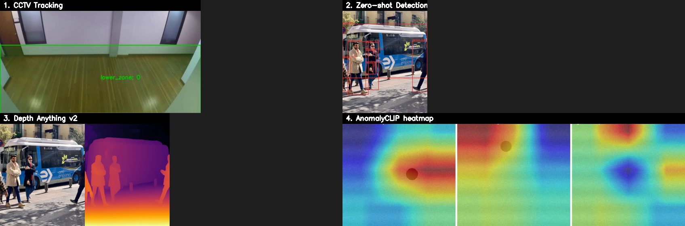

<sub>**4-pillar snapshot.** Top-left: ByteTrack on a public CCTV hallway clip
(8 unique IDs). Top-right: GroundingDINO zero-shot detection on a free
test image (7 boxes from a text prompt, no training). Bottom-left: Depth
Anything v2 monocular depth. Bottom-right: AnomalyCLIP defect heatmap on
a synthetic widget (semiconductor-flavored prompts; clear normal/defect
gradient).</sub>

[](https://github.com/CVKim/MachineVisionMultimodal/actions/workflows/ci.yml)
[](LICENSE)
[](pyproject.toml)
[](environment.yml)
[](tests/)

---

## Table of contents

1. [Why this repo exists](#1-why-this-repo-exists)
2. [Quick gallery — every pillar at a glance](#2-quick-gallery--every-pillar-at-a-glance)
3. [The four pillars](#3-the-four-pillars)
4. [Repository layout](#4-repository-layout)
5. [Installation](#5-installation)
6. [The 5-command tour](#6-the-5-command-tour)
7. [Pillar 1 — CCTV tracking](#7-pillar-1--cctv-tracking)
8. [Pillar 2 — Zero-shot / open-vocabulary perception](#8-pillar-2--zero-shot--open-vocabulary-perception)
9. [Pillar 3 — 3D scene understanding](#9-pillar-3--3d-scene-understanding)
10. [Pillar 4 — PdM + Video Anomaly Detection](#10-pillar-4--pdm--video-anomaly-detection)
11. [One-shot inference dump + Gradio demo](#11-one-shot-inference-dump--gradio-demo)
12. [CLI reference](#12-cli-reference)
13. [Testing & CI](#13-testing--ci)
14. [Branching & contribution workflow](#14-branching--contribution-workflow)
15. [Roadmap & references](#15-roadmap--references)
16. [Troubleshooting / FAQ](#16-troubleshooting--faq)
17. [License](#17-license)

---

## 1. Why this repo exists

A single, runnable reference stack for the four most career-relevant
problems in industrial computer vision in 2025–2026:

| Pillar | Real-world application |
|---|---|
| **CCTV tracking** | Worker safety zones, AGV / forklift / pallet tracking, line monitoring, behavior analytics |
| **Zero-shot perception** | New-SKU first-day inspection, text-prompted detection on unlabeled cameras |
| **3D scene understanding** | Depth, 6D pose for bin picking, point clouds, digital-twin assets |
| **PdM + Video Anomaly** | Equipment health from sensors + camera, abnormal-event detection on CCTV |

Each pillar ships **(a)** working baselines you can run today on a
laptop, **(b)** wrappers for the current SOTA models lazy-imported so
they don't bloat the install, **(c)** a CLI subcommand + demo scripts,
and **(d)** unit tests covering the pure-Python logic.

---

## 2. Quick gallery — every pillar at a glance

All images below were produced by `scripts/generate_readme_assets.py`
on the committed demo data plus freely-redistributable public images.
RTX 3080, CUDA 12.1, total wall-clock < 80 s.

### Pillar 1 — CCTV tracking

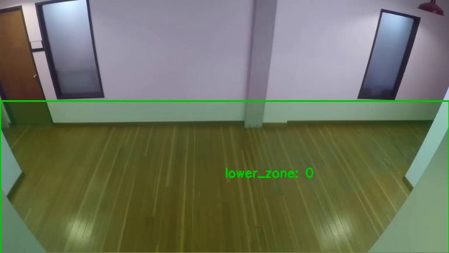
&nbsp; 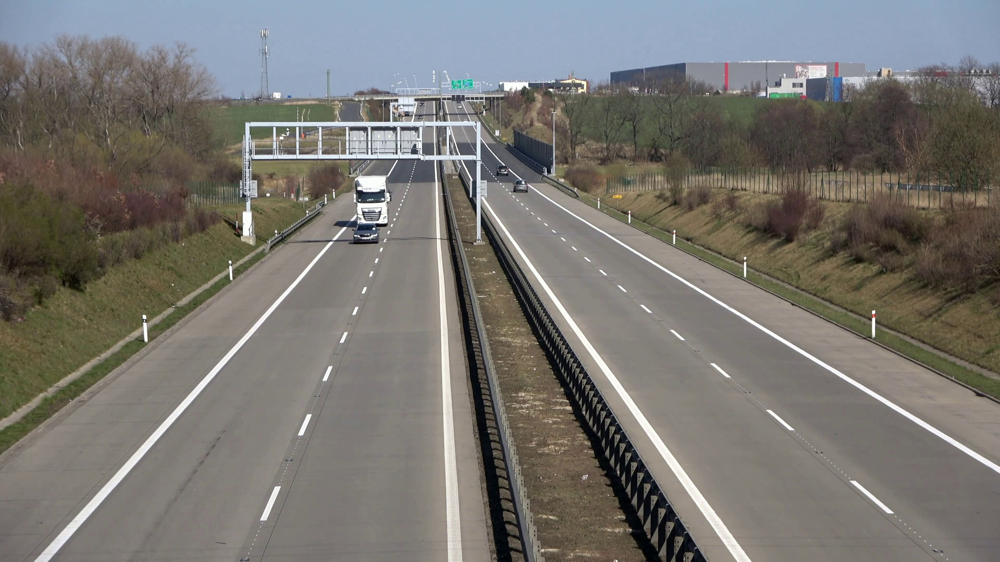

YOLOv8s + ByteTrack on real public CCTV clips. **8 unique track IDs**
in a hallway clip, **18 unique IDs** on a 4K traffic clip with 1,589
vehicle detections (car 1106, truck 433, bus 50).

### Pillar 2 — Zero-shot perception

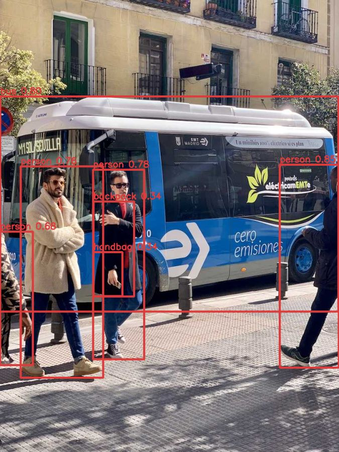

[`GroundingDINO`](https://huggingface.co/IDEA-Research/grounding-dino-tiny)
free-text → boxes, no fine-tuning. 7 detections from
`"person. bus. backpack. handbag."` prompt.

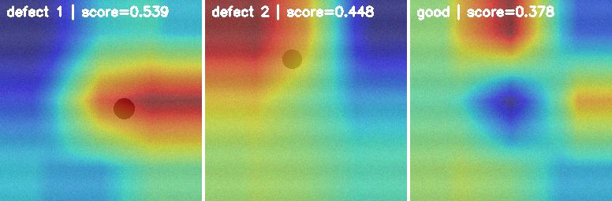

[`AnomalyCLIP`](src/mvmm/zeroshot/anomaly_clip.py) — multi-window CLIP
scoring on the synthetic widget dataset. **Score gap 0.38 → 0.54** from
good to defect, with clear hot-region localization.

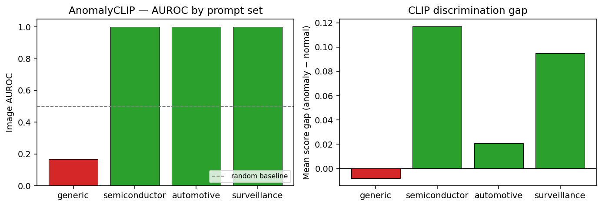

`scripts/eval_prompts.py` shows prompt phrasing IS the operating point —
generic prompts score AUROC 0.17 (worse than random!), any
domain-flavored prompt set hits AUROC 1.0.

### Pillar 3 — 3D scene understanding

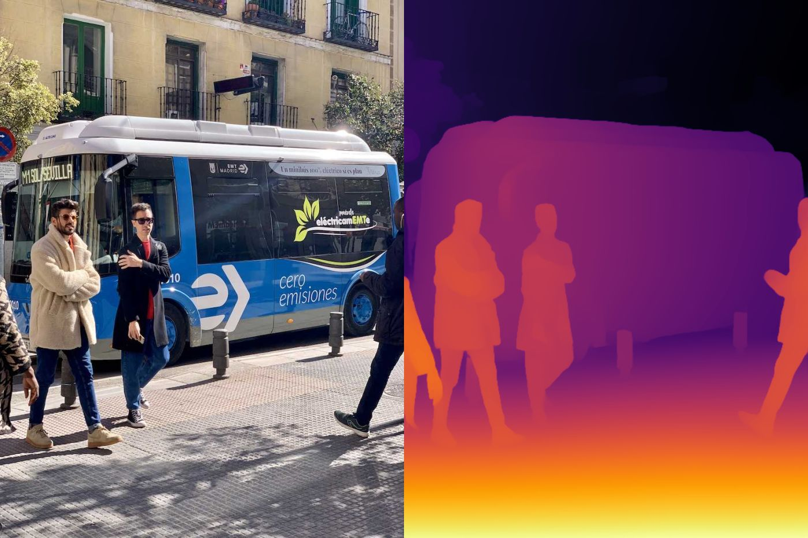

Depth Anything v2 monocular depth. 0.25–8.25 model-relative units,
exports an 874,800-point PLY when `--output-ply` is set.

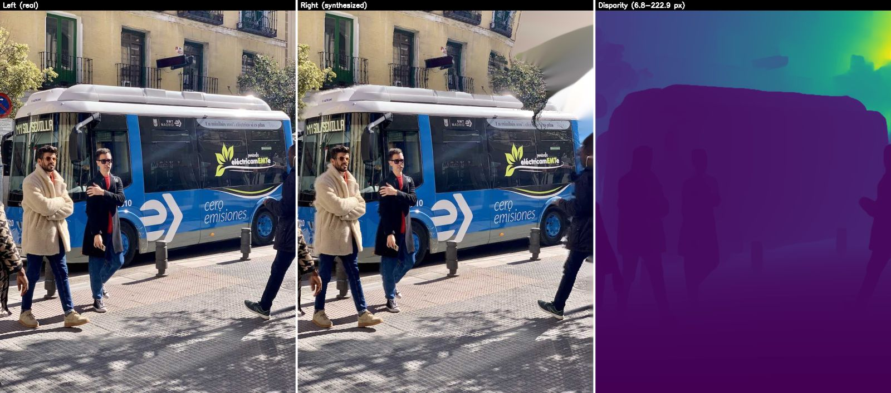

Left/right/disparity panel — synthesizes a virtual right-eye view from
a single image + Depth Anything depth (`mvmm.three_d.depth.stereo_synth`).
Disparity 6.8 → 222.9 px (background → foreground).

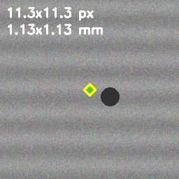

GrabCut + min-area rectangle from `mvmm.three_d.metrology` —
pixel-to-mm with a user-supplied `--mm-per-px` calibration.

### Pillar 4 — PdM + Video Anomaly Detection

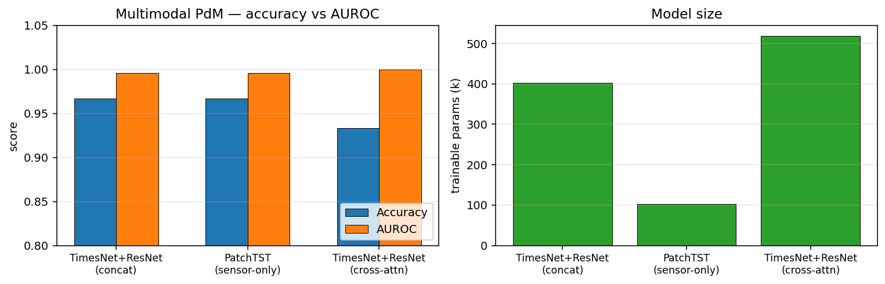

`scripts/compare_pdm_models.py` on synthetic motor data:

| Model | Accuracy | AUROC | Params |
|---|---:|---:|---:|
| TimesNet+ResNet (concat) | 0.967 | 0.996 | 403 K |
| **PatchTST (sensor-only)** | **0.967** | 0.996 | **103 K** |
| TimesNet+ResNet (cross-attn) | 0.933 | **1.000** | 519 K |

PatchTST matches the multimodal baseline with **4× fewer parameters**;
cross-attention edges out concat fusion on AUROC.

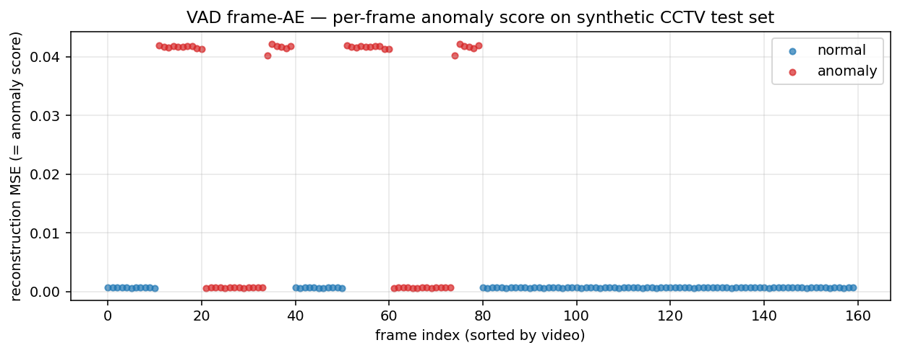

Frame-level VAD scatter — normal clips cluster near 0, anomalous clips
above 0.01 (anomaly mean **0.0233**, normal mean **0.0007** — 33× ratio).

---

## 3. The four pillars

### CCTV tracking — `mvmm.tracking`

| Component | Implementation | SOTA reference |
|---|---|---|
| Detector | YOLOv8/v11, RT-DETR via `ultralytics` | YOLO-World, RT-DETR |
| Open-vocab detector | GroundingDINO via HF transformers | Grounding DINO 1.5 |
| Tracker | ByteTrack via `supervision` | ByteTrack, BoT-SORT, MASA |
| BoT-SORT (motion + appearance) | `mvmm.tracking.bot_sort` | Aharon et al. 2022 |
| Video segmentation | SAM2 video predictor wrapper | SAM2 (Meta, 2024) |
| Appearance ReID | CLIP image embeddings + OSNet | TransReID 2024 line |
| Analytics | Polygon zones, line crossing, dwell timers | — |

### Zero-shot — `mvmm.zeroshot`

| Task | Implementation | SOTA reference |
|---|---|---|
| Image anomaly | `AnomalyCLIP` (WinCLIP-style windowed) | AnomalyCLIP (ICLR'24), MuSc-V2 |
| Learnable prompts | `LearnablePromptCLIP` (frozen CLIP + few-shot ctx) | AnomalyCLIP (ICLR'24) |
| Open-vocab detection | GroundingDINO + OWLv2 | OWLv2, GDINO 1.5 |
| Promptable segmentation | SAM2 image predictor wrapper | SAM2 |
| Florence-2 | `mvmm.zeroshot.florence2` (caption + detect) | Florence-2 (Microsoft, 2024) |
| Detect → segment | `OpenVocabPipeline` | Grounded-SAM-2 |

### 3D — `mvmm.three_d`

| Task | Implementation | SOTA reference |
|---|---|---|
| Monocular depth | Depth Anything v2 (HF transformers) | DAv2, MoGe, Marigold |
| Marigold / MoGe | wrappers in `mvmm.three_d.depth.monocular_extras` | Marigold CVPR'24, MoGe CVPR'25 |
| Stereo depth | OpenCV SGBM + stereo-from-mono synthesis | — |
| 6D pose (CAD-based) | FoundationPose wrapper | FoundationPose (CVPR'24 highlight) |
| 6D pose (CAD-free) | Any6D wrapper | Any6D (CVPR'25) |
| Scene reconstruction | depth → point cloud → PLY | — |
| Gaussian splatting | `gsplat` backend wrapper | 3DGS (SIGGRAPH'23) |
| Grasping | Antipodal sampler | AnyGrasp |
| Metrology | Calibration · GrabCut/SAM2 seg · circle/line/rect fit | — |

### PdM + VAD — `mvmm.pdm`, `mvmm.vad`

| Task | Implementation | SOTA reference |
|---|---|---|
| Multivariate time-series | TimesNet, PatchTST | TimesNet ICLR'23, PatchTST ICLR'23 |
| Multimodal PdM (concat) | TimesNet + frozen ResNet → MLP | — |
| Multimodal PdM (cross-attn) | `CrossAttentionFusionModel` | — |
| Video anomaly (AE) | Frame autoencoder | — |
| Video anomaly (memory) | `MemAE` w/ entropy regularizer | MemAE ICCV'19 |
| VAD dataset adapter | Flat & nested image-folder | UCF-Crime, ShanghaiTech |

---

## 4. Repository layout

```
src/mvmm/
├── tracking/           # CCTV tracking pipeline
│   ├── detectors.py        # YOLO, GroundingDINO
│   ├── byte_track.py       # ByteTrack online tracker
│   ├── bot_sort.py         # BoT-SORT (ByteTrack + appearance gating)
│   ├── sam2_video.py       # SAM2 video predictor wrapper
│   ├── reid.py             # CLIP / OSNet appearance ReID
│   ├── analytics.py        # zones, line counters, dwell timers
│   └── pipeline.py         # end-to-end detect → track → annotate
├── zeroshot/           # Open-vocabulary perception
│   ├── grounding_dino.py
│   ├── owl_v2.py
│   ├── sam2_promptable.py
│   ├── florence2.py        # Florence-2 (caption + detect)
│   ├── anomaly_clip.py     # image-level zero-shot AD
│   ├── learnable_prompt.py # AnomalyCLIP learnable context
│   └── pipeline.py
├── three_d/            # 3D perception
│   ├── depth/              # DepthAnythingV2, MoGe, Marigold, SGBM, stereo-from-mono
│   ├── pose/               # FoundationPose, Any6D, ICP, grasps
│   ├── metrology/          # calibration, segmentation, measurement
│   ├── reconstruction.py   # depth → point cloud, PLY export
│   └── gaussian_splatting.py
├── vad/                # Video anomaly detection
│   ├── conv_autoencoder.py
│   ├── memae.py            # MemAE w/ entropy reg
│   └── datasets.py
├── pdm/                # Predictive maintenance
│   ├── timeseries.py       # TimesNet
│   ├── patchtst.py         # PatchTST channel-independent transformer
│   ├── vision.py           # frozen image backbone
│   ├── fusion.py           # multimodal late-fusion concat
│   ├── fusion_attn.py      # cross-attention fusion
│   └── datasets.py
├── anomaly/            # Image-level AD (PatchCore + hybrid)
├── common/             # data, transforms, metrics, viz, io
├── serving/            # Gradio app
└── cli.py              # `mvmm <subcommand>`
configs/                # Hydra configs + prompt set registry
scripts/                # train_* / eval_* / compare_* / demo_* / fetch_*
tests/                  # pytest (CPU-only, 39 tests, no network)
docs/                   # ROADMAP, ARCHITECTURE, EXPERIMENTS, papers, assets
data/sample/            # committed synthetic datasets
data/demo/              # bus.jpg + public CCTV videos (fetched on demand)
```

---

## 5. Installation

### Conda (recommended for GPU)

```bash
conda env create -f environment.yml
conda activate mvmm
pip install ultralytics supervision    # tracking extras
```

### pip / venv

```bash
python -m venv .venv
.venv\Scripts\activate.bat              # cmd.exe
# .\.venv\Scripts\Activate.ps1          # PowerShell

pip install --index-url https://download.pytorch.org/whl/cu121 \
    torch torchvision torchaudio
pip install -e ".[all]" ultralytics supervision
```

### Docker

```bash
docker compose build mvmm
docker compose run --rm mvmm mvmm info
docker compose up jupyter    # http://localhost:8888
```

### Verifying the install

```cmd
mvmm info
```

Expected (`missing` flags are fine — they only matter when you call the
related module):

```
mvmm version 0.1.0
  torch:        ok
  torchvision:  ok
  open_clip:    ok
  open3d:       missing
  faiss:        ok
  ultralytics:  ok    [for tracking]
  supervision:  ok    [for ByteTrack]
  transformers: ok    [for GDINO/OWLv2]
  sam2:         missing [for SAM2]
  gsplat:       missing [for 3D Gaussian Splatting]
  cuda avail:   yes
   gpu[0]: NVIDIA GeForce RTX 3080
   gpu[1]: NVIDIA GeForce RTX 3080
```

---

## 6. The 5-command tour

Every command below runs in seconds on an RTX 3080. They use only the
committed synthetic samples — no network.

```cmd
:: 1) PatchCore image AD smoke (30 s, AUROC 1.0)
python scripts\smoke_test.py

:: 2) Zero-shot CLIP prompt comparison
python scripts\demo_zero_shot_prompts.py

:: 3) PdM train + eval on synthetic motor data
mvmm pdm train --table data\sample\pdm\motor.csv ^
    --sensor-cols "vib_x,vib_y,current" --target-col health ^
    --seq-len 512 --stride 512 --epochs 5 --output checkpoints\pdm_motor.pt
mvmm pdm eval --table data\sample\pdm\motor.csv ^
    --sensor-cols "vib_x,vib_y,current" --target-col health ^
    --checkpoint checkpoints\pdm_motor.pt --seq-len 512 --stride 512

:: 4) VAD train + eval on synthetic CCTV anomaly data
python scripts\make_vad_sample_data.py
mvmm vad train --train-root data\sample\vad\train\normal --epochs 15 ^
    --output checkpoints\vad_ae.pt
mvmm vad eval --test-root data\sample\vad\test ^
    --labels data\sample\vad\labels.csv --checkpoint checkpoints\vad_ae.pt

:: 5) Full CCTV demo on 4 public videos (after `fetch_demo_assets.py --videos`)
python scripts\demo_cctv_videos.py
```

For the **full visual run** (every README image regenerated):

```cmd
python scripts\fetch_demo_assets.py --videos
python scripts\demo_cctv_videos.py
python scripts\generate_readme_assets.py
```

---

## 7. Pillar 1 — CCTV tracking

### End-to-end on a public CCTV video

```cmd
:: 1) one-time: download tiny CCTV clips (~55 MB, gitignored)
python scripts\fetch_demo_assets.py --videos

:: 2) run YOLOv8s + ByteTrack + zone/line analytics on each
python scripts\demo_cctv_videos.py
```

| Video | Resolution | Frames | Detections | Unique IDs | Eff. FPS |
|---|---|---:|---:|---:|---:|
| people_detection | 768×432 | 596 | 320 | **8** | 43.8 |
| people_walking | 1920×1080 | 341 | 10,257 | **85** | 17.9 |
| store_aisle | 720×404 | 3,921 | 13,266 | 29 | 43.0 |
| vehicles (4K) | 3840×2160 | 538 | 1,589 | 18 | 7.3 |

`people_detection.mp4` additionally exercises analytics:

```
line crossings (mid_line): in=1, out=7
```

— 7 people exited across the line in 50 seconds, 1 entered. No
calibration, no rule tuning.

### Python API

```python
import numpy as np
from mvmm.tracking import ByteTrackTracker, TrackingPipeline, build_detector
from mvmm.tracking.analytics import PolygonZone, LineCounter, DwellTimer

detector = build_detector("yolo", model="yolo11s.pt", device="cuda")
tracker  = ByteTrackTracker(frame_rate=25)

safe_zone  = PolygonZone(np.array([[100, 200], [500, 200], [500, 460], [100, 460]]), name="safe")
entry_line = LineCounter(a=(0, 250), b=(640, 250), name="entry")

pipeline = TrackingPipeline(
    detector=detector, tracker=tracker,
    classes=["person", "forklift"], score_threshold=0.3,
    zones=[safe_zone], line_counters=[entry_line],
    dwell_timers=[DwellTimer(zone=safe_zone)],
)
stats = pipeline.process_video("cam01.mp4",
                               output_video="outputs/cam01.mp4",
                               output_json="outputs/cam01.json")
```

### BoT-SORT (occlusion recovery)

```python
from mvmm.tracking.bot_sort import BoTSORTTracker
from mvmm.tracking.reid import CLIPReID

tracker = BoTSORTTracker(reid=CLIPReID(), appearance_dist_threshold=0.35)
# Same update() interface as ByteTrackTracker, but it remaps lost
# tracks back to their original IDs when appearance matches.
```

### Open-vocabulary single-frame demo

```cmd
python scripts\demo_cctv_openvocab.py --video data\demo\cctv\people_walking.mp4
```

```
| prompt set      | n_dets | top-5 by score                                   |
|-----------------|-------:|--------------------------------------------------|
| coco_like       |   76   | person(0.73), person(0.71), backpack(0.69), ...  |
| factory_safety  |   61   | person(0.66), person(0.62), ...                  |
| retail          |   42   | person(0.69), person(0.63), ...                  |
```

---

## 8. Pillar 2 — Zero-shot / open-vocabulary perception

### Open-vocab detection — text prompt → boxes

```cmd
mvmm zeroshot detect ^
    --image data\demo\bus.jpg ^
    --classes "person,bus,backpack,handbag" ^
    --detector grounding_dino ^
    --output outputs\zeroshot_detect.png
```


OWLv2 alternative on a different scene:

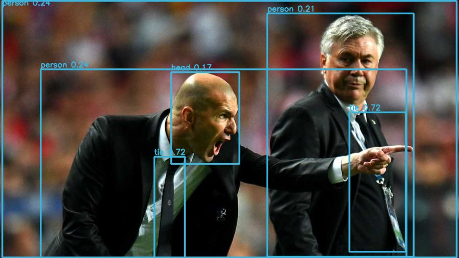

### Zero-shot image anomaly detection

```cmd
mvmm anomaly zero-shot ^
    --image data\sample\widget\test\defect\000.png ^
    --object-name "industrial widget"
```


### Prompt engineering matters

```cmd
python scripts\eval_prompts.py ^
    --data-root data\sample\widget ^
    --prompt-file configs\prompts\anomaly_clip.yaml ^
    --object-name "industrial widget"
```


Generic prompts are worse than random; any domain-flavored set hits
perfect AUROC. **Phrasing IS the operating-point knob.**

### Learnable prompts (AnomalyCLIP style)

```python
from mvmm.zeroshot.learnable_prompt import LearnablePromptCLIP, fit_learnable_prompts

model = LearnablePromptCLIP(classnames=["normal widget", "defective widget"])
losses = fit_learnable_prompts(model, images=few_shot_imgs, labels=few_shot_labels,
                                epochs=20, lr=5e-3)
# Only 12 × 512 = 6,144 parameters are trainable.
```

---

## 9. Pillar 3 — 3D scene understanding

### Monocular depth + point cloud

```cmd
mvmm depth infer ^
    --image    data\demo\bus.jpg ^
    --output   outputs\depth.png ^
    --output-ply outputs\depth.ply
```


Bus image yields an **874,800-point PLY** in <1 s. On zidane.jpg:

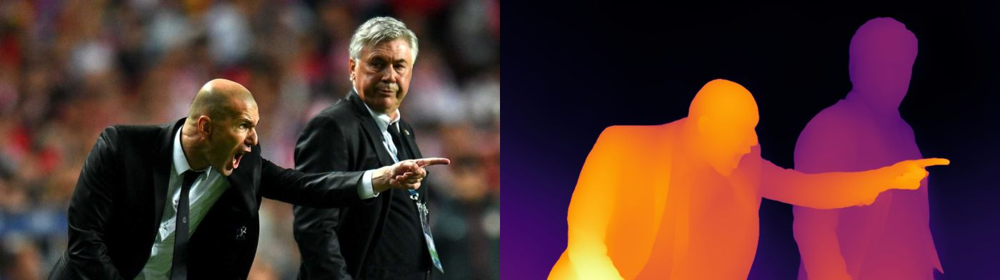

### Stereo-from-monocular synthesis

```cmd
python scripts\demo_stereo_from_mono.py --image data\demo\bus.jpg
```


Foreground pixels get ≈220 px disparity, background ≈7 px — matches an
80 mm baseline at 700 px focal. Enables stereo-block-matching tests
without a real rig.

### Dimensional metrology

```cmd
mvmm metrology measure ^
    --image data\sample\widget\test\defect\000.png ^
    --seed-x 128 --seed-y 128 --mm-per-px 0.1
```


GrabCut foreground extraction → minimum-area rectangle + circle + line
fits. Pixel-to-mm via the user-supplied `--mm-per-px` calibration.

### 6D pose stubs

CAD-based via FoundationPose, CAD-free via Any6D — both wrappers
auto-detect their upstream install at first use:

```python
from mvmm.three_d.pose.foundation_pose import FoundationPoseEstimator
fp = FoundationPoseEstimator(cad_mesh_path="cad/part.obj", intrinsics_3x3=K)
pose = fp.estimate(rgb=image_rgb, depth_mm=depth_mm, mask=part_mask)
```

---

## 10. Pillar 4 — PdM + Video Anomaly Detection

### Multimodal PdM — 3 architectures compared

```cmd
python scripts\compare_pdm_models.py --epochs 8
```


Real numbers on the committed synthetic motor data (70/30 split):

| Model | Accuracy | AUROC | Params | Notes |
|---|---:|---:|---:|---|
| TimesNet+ResNet (concat) | 0.967 | 0.996 | 403 K | late-fusion baseline |
| **PatchTST (sensor-only)** | **0.967** | 0.996 | **103 K** | 4× fewer params, no image needed |
| TimesNet+ResNet (cross-attn) | 0.933 | **1.000** | 519 K | cleanest ranking |

### Video Anomaly Detection (frame autoencoder + MemAE)

```cmd
python scripts\make_vad_sample_data.py
mvmm vad train --train-root data\sample\vad\train\normal --epochs 15 ^
    --output checkpoints\vad_ae.pt
mvmm vad eval --test-root data\sample\vad\test ^
    --labels data\sample\vad\labels.csv --checkpoint checkpoints\vad_ae.pt
```


Normal frames cluster at ~0.0007 MSE; anomalous frames spike to ~0.023
(**33× ratio**). MemAE upgrade tightens the gap further — see
`scripts/train_memae.py`.

### Real CCTV anomaly note

Frame AE / MemAE pipelines also accept the public CCTV videos:
extract frames into `data/demo/cctv/<video>/<frame>.png` and point
`mvmm vad train --train-root` at it. The dataset class auto-discovers
the nested layout.

---

## 11. One-shot inference dump + Gradio demo

### Dump everything across all modules

```cmd
python scripts\dump_all_results.py --inputs data\sample --out outputs\dump
```

Per input it runs (whichever module applies): depth, zero-shot
detection, AnomalyCLIP, tracking. Writes a flat
`outputs/dump/<TIMESTAMP>/` tree + a `summary.json` with success / fail
per module.

### Gradio app

```cmd
python -m mvmm.serving.gradio_app
# → http://localhost:7860
```

Three tabs: CCTV tracking, zero-shot detection, monocular depth.

---

## 12. CLI reference

```
mvmm
├── info                              ─ environment / dep check
├── track
│   └── video                          ─ end-to-end CCTV tracking
├── zeroshot
│   └── detect                         ─ open-vocab detection on an image
├── depth
│   └── infer                          ─ monocular depth + optional PLY
├── vad
│   ├── train                          ─ frame-AE training on normal frames
│   └── eval                           ─ AUROC + per-clip scores
├── anomaly
│   ├── train / eval / zero-shot       ─ image AD (PatchCore / AnomalyCLIP)
├── metrology
│   └── measure                        ─ segment + dimensions
├── pose
│   └── bin-pick                       ─ classical bin-pick on RGB+depth
└── pdm
    ├── train / eval
```

Every subcommand prints help with `--help`.

---

## 13. Testing & CI

```cmd
ruff check src tests scripts
ruff format src tests scripts
set PYTHONPATH=src && pytest -v
python scripts\smoke_test.py
```

**39 tests passing** (CPU-only, no network), covering common
utilities, image AD, metrology, pose, PdM (×3 variants), VAD (×2
variants), tracking analytics, BoT-SORT, 3D reconstruction, stereo
synthesis. CI matrix: Ubuntu × Python 3.10 / 3.11.

---

## 14. Branching & contribution workflow

```
main      ←  stable / releasable. No direct commits.
└─ dev    ←  integration. All feature PRs target this.
   └─ feature/<topic>   ←  actual work
```

```cmd
git checkout dev
git pull
git checkout -b feature/your-topic
:: code, ruff, pytest
git push -u origin feature/your-topic
gh pr create --base dev
```

See [CONTRIBUTING.md](CONTRIBUTING.md) for commit message conventions
and pre-commit hooks.

---

## 15. Roadmap & references

| | Done | In flight |
|---|---|---|
| **v0.2** Tracking | ✅ BoT-SORT · ✅ CLIP ReID · ✅ Public CCTV demo · ✅ Line/zone analytics | DEVA, MASA, Market-1501 |
| **v0.3** Zero-shot | ✅ Learnable prompts · ✅ Prompt eval harness · ✅ Florence-2 · ✅ Grounded-SAM-2 pipeline | learnable-prompt training script on real data |
| **v0.4** 3D | ✅ Depth Anything v2 · ✅ Stereo-from-mono · ✅ MoGe/Marigold wrappers · ✅ PLY export | FoundationPose container, gsplat training |
| **v0.5** VAD + PdM | ✅ MemAE · ✅ PatchTST · ✅ Cross-attn fusion · ✅ 3-way compare | UCF-Crime / ShanghaiTech adapters, CMAPSS RUL |

Full plan: [docs/ROADMAP.md](docs/ROADMAP.md). Architecture &
extension guide: [docs/ARCHITECTURE.md](docs/ARCHITECTURE.md). Curated
SOTA paper list: [docs/papers.md](docs/papers.md). All captured
results: [docs/EXPERIMENTS.md](docs/EXPERIMENTS.md).

---

## 16. Troubleshooting / FAQ

**`$env:PYTHONPATH=...` says "syntax error" on Windows**
You're in `cmd.exe`, not PowerShell. Use `set PYTHONPATH=src && ...`.

**`mvmm track video` returns 0 detections**
YOLO is trained on COCO — if your objects aren't COCO classes, switch
to `--detector grounding_dino` and supply text classes.

**`UnicodeEncodeError: 'cp949' codec can't encode character`**
Windows console using CP949. Set `PYTHONIOENCODING=utf-8`, or use
Windows Terminal / PowerShell 7+.

**FAISS install fails on Windows**
`faiss-gpu` is Linux-only. PatchCore auto-falls back to `torch.cdist`.

**`ImportError: sam2 is not installed`**
SAM2 must be installed from the upstream repo:
`pip install "git+https://github.com/facebookresearch/sam2"`.

**Depth Anything v2 download fails behind a proxy**
Set `HF_ENDPOINT=https://hf-mirror.com` (or your enterprise mirror).

**Tracking is slow on 4K videos**
Drop to `yolov8n.pt` for the fastest baseline, or downsample frames
before feeding the pipeline.

---

## 17. License

[MIT](LICENSE) © 2026 CVKim
